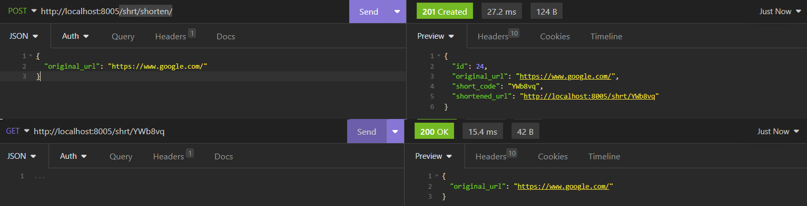

# url-shortener

## Instruction
1. Have docker and python 3.11 installed
2. Create venv and install poetry:
```bash
python -m venv venv_poetry_311
source venv_poetry_311/bin/activate
poetry install
```
3. Build the docker image
```bash
docker compose build
```
4. Run the service
```bash
docker compose up
```
5. Run migration if needed
```bash
docker exec -it <web_docker_image_name> bash
# and in the container
poetry run python src/manage.py migrate
```
6. The service is available here: `http://localhost:8005`

## Assumptions I made
- I treated this project as MVP so I followed minimalistic approach. 
- This backed needs significant extension if a large numbers of links is to be stored. The behaviour of the backend can be modified by modifying `MAX_SHORTEN_URL_LENGTH` and other constants.
- The db is the simplest choice possible
- If a short link `x'` was created for url `x`, then creating short link for `x` one more time will return the same short link `x'`. In other words, long url can have exactly one short url assigned.


## Example
